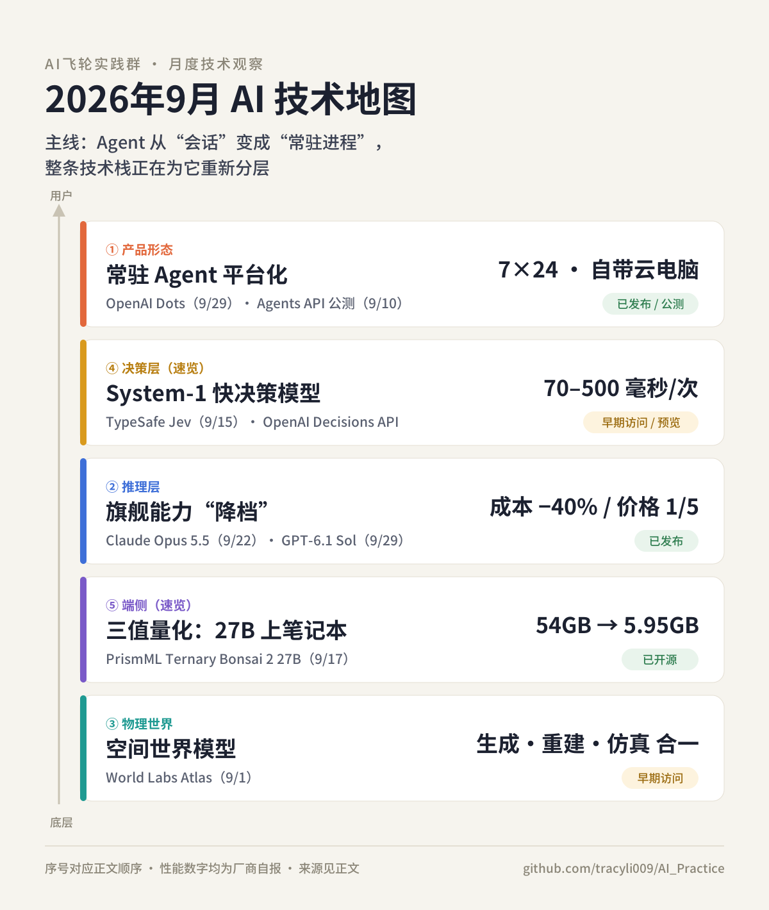

# 🤖 本月最值得关注的 AI 技术｜2026.09.01–09.30

> AI飞轮实践群 · 月度技术观察 · 主编：Tracy

**本月主线：** Agent 正在从“你问一句、它答一句”的会话，变成有身份、有电脑、7×24 小时运行的常驻进程。围绕这个变化，整条技术栈都在重新分层：运行框架交给平台托管，简单判断拆给毫秒级小模型，旗舰能力被压到更便宜、更小的形态。

## ⏱️ 30 秒速览

| # | 技术 | 代表发布 | 成熟度 | 最该关注的人 |
|---|---|---|---|---|
| 1 | 常驻 Agent 平台化 | OpenAI Dots / Agents API | 已发布 + 公测 | 创业者、产品负责人 |
| 2 | 旗舰能力“降档” | Claude Opus 5.5 / GPT-6.1 Sol | 已发布 | 工程师、管预算的人 |
| 3 | 空间世界模型 | World Labs Atlas | 早期访问 | 机器人、3D、投资人 |
| 4 | System-1 快决策模型 | TypeSafe Jev / OpenAI Decisions API | 早期访问 / 预览 | Agent 工程师 |
| 5 | 三值量化：27B 上笔记本 | PrismML Ternary Bonsai 2 27B | 已开源 | 端侧、隐私敏感行业 |

*1–3 为深读，4–5 为速览。*

---

### 1️⃣ Agent 从“会话”变成“常驻员工”：OpenAI Dots + Agents API

**发生了什么：**
9 月 29 日 OpenAI DevDay 发布 Dots：由 GPT-6 Astra 驱动的常驻智能体（always-on agent）。每个 dot 有自己的云电脑和浏览器，可连接 4000 多个应用，在 ChatGPT、Slack、Teams 里随叫随到。

空闲时它用**只读**权限做“主动研究”；涉及账户或外发信息的动作，先经自动审查（auto-review），用户可设定“直接做 / 需批准 / 禁止”。

开发者侧，9 月 10 日上线的 Agents API（公测）把驱动 Codex 的 harness（智能体运行框架：管上下文、调工具、编排子智能体）作为托管服务开放，支持长会话压缩和多智能体并行，不另收平台费。

**为什么重要：**
做 Agent 最难的不是模型，而是“让它连续跑几天不崩”的工程：上下文、沙箱、权限、故障恢复。现在这一层被打包成了基础设施。

Agent 的形态也变了：从一次性对话，变成有身份、有算力、有权限边界的“数字员工”。

**距离落地还有多远：**
Dots 已向 Pro 和 Business Premium 用户分批推送（限部分市场），企业版为 beta，“专职 dot”仅做企业试点。Agents API 为公测。

限制：Astra 成本高；自主运行仍会出错，官方也提醒重要结果需人工复核；客户效果数据均为自述。

**我们可以关注什么：**
如果你的护城河是“自研 Agent 框架”，现在要重新评估。更值钱的位置在：垂直数据、行业工具（MCP 连接器）、审批与审计流程。工程师可以拿同一批任务，对比自研 harness 和 Agents API 的成功率与单任务成本。

**来源：**
- [OpenAI：Introducing dots（2026-09-29）](https://openai.com/index/introducing-dots/)
- [OpenAI：Introducing the Agents API（2026-09-10）](https://openai.com/index/introducing-the-agents-api/)
- [OpenAI：DevDay 2026 Recap](https://openai.com/index/devday-2026-recap/)

---

### 2️⃣ 旗舰能力“降档”：比的不再是单价，而是每个任务花多少钱

**发生了什么：**
9 月 22 日，Anthropic 发布 Claude Opus 5.5，称在大多数工作上达到 Claude Fable 5.1 水平，典型负载成本比 Opus 5 低 40%。定价为每百万 token 输入 4 美元、输出 20 美元，缓存读取降 60% 至 0.20 美元。

9 月 29 日，OpenAI 发布 GPT-6.1 Sol，称在智能体编程、电脑操作和专业工作上接近 GPT-6 Astra，标准价格只有 Astra 的五分之一（输入 2 美元 / 输出 10 美元），缓存输入 0.10 美元。

**为什么重要：**
两家同月做了同一件事：不比谁最强，而比“接近最强，但便宜得多”。

两家都重点下调了**缓存价格**：Agent 会反复读取同一段上下文，缓存读取是编程类任务成本的大头。Anthropic 还强调 Opus 5.5 完成同样任务用的 token 更少——降本来自“更少步数做完”，不只是降价。

**距离落地还有多远：**
已正式发布，API 和主流云平台均可用。

但所有基准分数都是厂商自报，且各挑对自己有利的测试。Opus 5.5 在 Terminal-Bench 4.0 上报 66.4%（Astra 为 57.9%）；OpenAI 则称 6.1 Sol 在 AutomationBench 上超过 Opus 5.5。Anthropic 自己也承认，到这个能力水平，基准分差对真实差异的参考价值在下降。

**我们可以关注什么：**
别再靠排行榜选模型。用你自己的 20–50 个真实任务，测“每个**成功**任务的成本”和缓存命中率。上个季度算不过账的场景（批量代码迁移、尽调、报表），值得重新算一次 ROI。

**来源：**
- [Anthropic：Introducing Claude Opus 5.5（2026-09-22）](https://www.anthropic.com/claude-opus-5-5)
- [OpenAI：Introducing GPT-6.1 Sol（2026-09-29）](https://openai.com/index/introducing-gpt-6-1-sol/)

---

### 3️⃣ 世界模型走向“统一底座”：World Labs Atlas

**发生了什么：**
9 月 1 日，李飞飞创立的 World Labs 发布 Atlas：一个从头预训练、原生处理文字、图像、视频和 3D 的“全能世界模型”（omni world model）。

核心设计是“空间上下文”：每张输入图片都被锚定在 3D 空间的某个位置，模型据此生成新视角、重建真实场景、模拟世界随时间的变化。输入可以从 1 张到上百张图——看到的越多，“想象”的越少。

**为什么重要：**
过去，可控视频生成、3D 重建、仿真是三套独立系统，Atlas 试图用一个模型统一。

它最大的潜在价值不在特效，而在机器人：用手机拍一个真实空间，就能重建成机器人可训练的仿真环境，即 Real-to-Sim（从真实到仿真）。这正对准具身智能最缺的东西：训练数据和训练环境。

**距离落地还有多远：**
研究发布 + 早期访问，外部还无法大规模测试。“超过专用 3D 模型”等结论来自公司自评。物理是否准确、几何结构能否直接给仿真器使用，都未经独立验证。

**我们可以关注什么：**
机器人和 XR 团队：盯两件事——Atlas 何时开放 API，输出的 3D 资产能否直接进入现有仿真器。投资人：世界模型赛道定义仍在分化（World Labs、AMI Labs、Odyssey 各走一条路），判断标准应是“谁先进入机器人训练闭环”。

**来源：**
- [World Labs：Atlas: A World Model for Spatial Intelligence（2026-09-01）](https://worldlabs.ai/blog/atlas)
- [SiliconANGLE：World Labs debuts Atlas](https://siliconangle.com/fei-fei-lis-world-labs-debuts-atlas-a-world-model-showcase-for-advanced-spatial-intelligence)

---

### 4️⃣ 速览｜Agent 栈拆出“快决策层”：System-1 模型

TypeSafe AI 于 9 月 15 日推出 Jev，自称首个“System One 模型”（借用卡尼曼“快思考”的概念）：不生成文字，只对预设问题返回带置信度的结构化决策——比如请求该路由给谁、某个动作是否放行。官方称延迟 70–500 毫秒，输入每百万 token 0.042 美元。两周后，OpenAI 在 DevDay 推出思路相近的 Decisions API（有限预览，基于 GPT-6 Luna）。

**判断：** 两家同月入场，说明“一个大模型包办一切”正在退回原型阶段的做法，生产级 Agent 会分成“慢思考 + 快决策”两层。但 Jev 的数据全是自测，公司也坦言无法证明当前定价没有补贴。可以先把护栏检查、模型路由这类“选择题”单独拎出来做实验。

**来源：** [TypeSafe 官网](https://typesafe.ai) · [OpenAI DevDay 2026 开发者资源汇总](https://community.openai.com/t/devday-2026-announcements-and-developer-resources/1402006)

---

### 5️⃣ 速览｜27B 推理模型塞进 6GB：三值量化

PrismML 于 9 月 17 日开源 Ternary Bonsai 2 27B：把 Qwen3.8-27B 的权重压成 {−1, 0, +1} 三个值（三值量化，ternary），平均 1.72 bit/权重，体积从约 54GB 降到 5.95GB，在 14 项推理基准上保留 98.2% 的平均分；M5 Pro 笔记本上约 28 token/秒。

**判断：** 常规 2-bit 量化在数学、代码等长推理任务上会断崖下跌，Bonsai 2 基本守住了，这是真正的技术增量。限制：必须用 PrismML 的 llama.cpp 分支；知识类和视觉类任务掉分更多；评测由厂商自己完成。医疗、法律、财务等数据不能出本地的场景，值得现在就试。

**来源：** [Hugging Face 模型卡](https://huggingface.co/prism-ml/Ternary-Bonsai-2-27B-gguf) · [PrismML Bonsai-demo（GitHub）](https://github.com/PrismML-Eng/Bonsai-demo)

---

*本月未入选：Gemini 3.8 Flash、Grok 4.7 等属于常规迭代，技术增量有限。*

### 🔍 Tracy 的本月判断

九月真正的变化，不是哪个模型登顶，而是 Agent 的“经济结构”被改写：运行框架交给平台托管，简单判断交给毫秒级小模型，复杂推理用“准旗舰”的价格买到，敏感数据留在本地跑。对创业者来说，“自建 Agent 底座”的窗口正在关闭。接下来的竞争点是三件事：谁掌握行业工具和数据，谁把人机审批流程设计好，谁能把每个任务的成本算清楚。

### 💬 群里聊聊

企业部署常驻 Agent，应该给它发一张独立“工牌”（自己的账号、权限和审计记录），还是只允许它代理员工本人的账号？前者好管控，但等于凭空多了一个“员工”；后者责任清晰，但权限容易越界。你的公司会选哪条路？

---

说明：文中性能与成本数据除特别注明外，均来自厂商官方发布，尚未经独立第三方验证。整理日期：2026-10-02。
